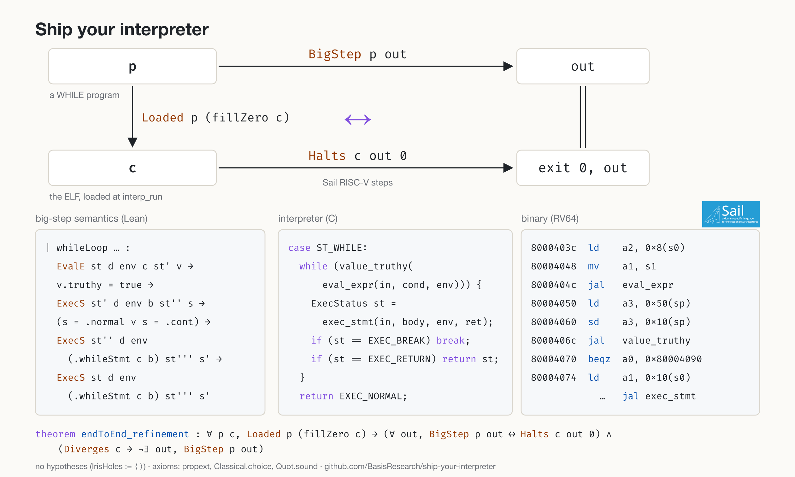

# Ship your interpreter

This Lean 4 project verifies `c/while-riscv-htif.elf`, a WHILE-language
interpreter compiled to bare-metal RV64 with HTIF I/O. The proof relates an
inductive big-step semantics of WHILE to the binary's execution in the
Sail-generated RISC-V model.



```lean
theorem endToEnd_refinement :
    ∀ p c, Loaded interpRunLayout p (fillZero c) →
      (∀ out, BigStep p out ↔ Halts c out 0) ∧
      (Diverges c → ¬ ∃ out, BigStep p out)
```

- Statement: [`VsaIris/Interp/EndToEnd.lean`](VsaIris/Interp/EndToEnd.lean). No hypotheses: every allocator and newlib routine the binary calls is proved.
- Axioms: `propext`, `Classical.choice`, `Quot.sound`.
- `Loaded` witnesses from real boot traces of ten programs: [`Vsa/Sim/Boot/`](Vsa/Sim/Boot). The proof ELF: `proofElf_halts` ([`Vsa/Sim/Boot/EndToEnd.lean`](Vsa/Sim/Boot/EndToEnd.lean)).
- Assumptions on the program: `capacity` (heap fits the arena), `stack_admissible` (recursion fits the stack).
- Soundness reviews of the hypotheses: [`REVIEW.md`](REVIEW.md), [`REVIEW2.md`](REVIEW2.md). Iris layer and its design: [`VsaIris/`](VsaIris), [`VsaIris/INTERP_DESIGN.md`](VsaIris/INTERP_DESIGN.md).

The tooling that makes this tractable is documented separately in
[`TOOLING.md`](TOOLING.md): proof generators, validation commands, and
incremental builds.

## Layout

| File | Content |
| --- | --- |
| `c/` | the C interpreter (lexer → parser → AST → evaluator), its host build, the cross-compiled RISC-V ELF under verification, and its test suite |
| `riscv-lean/` | vendored Sail-generated RISC-V models (`Lean_RV64D`, executable variant), a Lean emulator, and `lean-sail` at rems-project@0794631 patched so unmapped addresses read as zero (zero-initialised RAM) |
| `Vsa/ElfBytes.lean`, `Vsa/Elf.lean` | the ELF embedded byte-for-byte as a Lean term; ELFSage parse; a pure fuel-bounded runner over the Sail RV64D step. The native harness `vsa_run` reproduces the binary's behaviour: exit 0, `55\n2500\n36\n`, 382,730 steps |
| `Vsa/Machine.lean` | **the ISA as an inductive transition relation** (the graph of one architectural step), the behaviours `Halts`/`Diverges`, and determinism plus behaviour-uniqueness lemmas |
| `Vsa/While/Ast.lean` | deep embedding of WHILE, mirroring `c/src/ast.h` |
| `Vsa/While/Semantics.lean` | **the inductive big-step semantics**. Store-based mutable environments shared by closures, C truncating division, string coercion, `break`/`continue`/`return` statuses, `print`/`println`/`assert`. Purely relational: nothing in the theory evaluates WHILE |
| `Vsa/While/Derive.lean` | `bigstep_derive`, a syntax-directed tactic that *constructs* derivation trees of the big-step relation for closed programs. Untrusted meta-code; the kernel checks the derivations |
| `Vsa/While/Programs.lean`, `Vsa/While/Validation.lean` | the `c/tests/*.wl` scripts as deep embeddings, plus kernel-checked theorems `BigStep prog "<binary's output>"` that validate the semantics against I/O examples obtained by running the binary |
| `Vsa/MemRepr.lean` | **the inductive memory-representation relation**: when RV64 memory holds the C AST structs (`ast.h`, LP64, little-endian) that represent a deep-embedded program |
| `Vsa/Refinement.lean` | **the ∀-program refinement theorem** |
| `Vsa/Triple.lean` | **the Layer 1 program logic**: total-correctness Hoare triples over the ISA relation, model-independent, with step-counting (`TripleN`) for divergence simulation |
| `Vsa/Sim/` | Instruction decoding, runtime representations, function contracts, recursive simulation, and residual suppliers |
| `experiments/` | Lean proof probes, SMT and fuzz validation, and coverage data |
| `experiments/smt/PROOF_CLOSURE_PLAN.md` | Current proof status, remaining work, and incremental-build rules |

## The refinement statement

```lean
theorem refinement {L : Layout} (H : InterpSim L) :
    ∀ p c, Loaded L p c →
      (∀ out, BigStep p out ↔ Machine.Halts c out 0) ∧
      (Machine.Diverges c → ¬ ∃ out, BigStep p out)
```

`Loaded L p c` says configuration `c` sits at the interpreter phase with `p`'s
memory representation, via the inductive `ProgramRepr`. `InterpSim` is the
forward-simulation obligation. Every derivable behaviour is realised by the
machine, and underivable programs never halt cleanly.

The theorem is instantiated at `L := Vsa.Sim.LayoutInstance.interpRunLayout`
(`Vsa/Sim/LayoutInstance.lean`), whose `Loaded` is
`∃ a n, ProgramRepr c.σ.mem a n p ∧ InterpRunReady c a n`. It is the
theorem's whole hypothesis, so read it as the contract with the loaded
binary. `InterpRunReadyFacts` requires, at `interp_run`'s entry:

- **Machine state.** `pc = 0x800043ec`; the ABI arguments `a0 = &interp`
  (`0x87fffe10`), `a1 = stmts`, `a2 = count`, `a3 = 0` (script mode);
  `ra`, `sp = 0x87fffd00`, `gp`, `s0 = &_impure_ptr`; every general register
  present; `GoodState` (machine mode, `misa`/`mstatus` at their reset
  values, traps undelegated, HTIF idle); `main`'s saved return address.
- **Image and runtime data.** The exact `.text` and `.rodata` bytes of
  `c/while-riscv-htif.elf` (`FixedTextLoaded`, `FixedRodataLoaded`), the
  static pins `snprintf`/`vfprintf` read, newlib's stdout `FILE`
  (`ConsoleStream`: unbuffered, one-byte buffer, `__swrite`), the idle
  `stdin`/`stderr` `FILE`s and empty `atexit` list (`ExitRuntimeData`),
  `_impure_data._stderr`, and no console output yet (`OutRepr`).
- **The interpreter object.** `Interp.globals` and `call_depth = 0`, the
  object and its `jmp_buf` inside RAM above the HTIF words, and 8 MiB of
  stack below `sp` with every stack byte present in the memory map.
- **The AST.** `stmts` is an 8-aligned array of `count` `Stmt*` in RAM,
  `ProgramRepr` holds for `p`, and the AST's bytes are immutable shared
  bytes: outside the writable ELF sections, the stack, the global frame's
  header and arrays, and every allocation the interpreter may write
  (`InitialOwned`). Strings are ASCII (`CStr` requires bytes below 128).
- **The initial store.** The global frame holds exactly `print`, `println`,
  `assert` (`StoreRepr initSt.store` with their entry addresses), with
  capacity 8, in three whole in-use dlmalloc chunks (`BootFrameChunks`).
- **The allocator.** dlmalloc's heap `[_end, __heap_end)` in its canonical
  shape (`DlHeap.HeapAt`: a chunk walk from `_end` to the top chunk, free
  chunks on exactly one well-formed bin, page-aligned break, 32-bit
  `binblocks`, the top chunk at least 16 bytes below the break).
- **Two program-dependent assumptions**, both universally quantified over
  the program the memory represents:
  - `InitialAllocatorAt.capacity` — for every terminating derivation of
    `p` with modeled allocation cost `n` (`Vsa/While/Cost.lean`),
    `2 * n + 8256 ≤ __heap_end − top`: the heap has room for the run. A
    terminating program that allocates more than the free heap is *not*
    `Loaded`; the binary prints `out of memory` and exits 1, and the
    theorem says nothing about it.
  - `stack_admissible` — `ProgramStackFits p`: the statically computed
    stack need of `p` (nesting depth of its statements and expressions,
    the 1000-deep call budget, the evaluator frame, the helpers'
    headroom, `interp_run`'s frame) fits below `sp`, and every function
    body fits one call level.

`REVIEW.md` audits this hypothesis against the binary's real entry state;
the fields that no real run satisfies are listed there with proposals, all
landed (P1–P4, P7). `REVIEW2.md` is the final audit: the theorem is
unconditional (the former `IrisHoles` was emptied and removed), and it is instantiated at the
binary's real `interp_run` entry states.

**The witnesses and the two native links.** `Loaded` is proved by the kernel
at ten real entry states (`Vsa/Sim/Boot/Gen/<Prog>.lean`, generated by
`scripts/gen_boot_witness.py`): the memory is the ELF loader's image plus the
emulator's traced store log, the registers are the traced `x1 … x31`, and
`Gen.<Prog>.loadedEntry_fill` states the witness at ANY configuration whose
registers satisfy `EntryRegs` (`GoodState`, `PC`, `htif_payload_writes`, the
traced GPRs; `Vsa/Sim/Boot/Entry.lean`), whose console is empty and whose
memory the entry view is a partial view of. `Vsa/Sim/Boot/Audit.lean` derives
the hypothesis-free capstones from them (`ReviewV2.proofElf_halts_entry`:
that state prints `55 2500 36` and exits 0; `errDivzero_never_clean_entry`).
Two facts connect the generated data to the binary and are checked
**natively, not by the kernel** (the kernel never parses the 138 KB ELF and
never runs the boot): (1) `ElfLoads` — the ELFSage parse of `Vsa.elfHex`
loads exactly the generated image (`initializeMemory_eq` takes it as a
premise); (2) the traced store log is the machine's — the emulator's
`--trace-all` store operands, whose fold the kernel checks (`LogOk`).
`experiments/review-v2/Replay.lean` re-checks both per build
(`scripts/check_all.sh` stage c3): it evaluates `ElfLoads`, runs the theorem's
own `Vsa.stepOnce` from `initializeMemory` to the entry, and compares the
reached state with the witness (every byte, `EntryRegs`, the console), then
runs both to halt. These two links, and the emulator itself, are the trust
base beside the Lean kernel and the Sail model.

```lean
theorem Vsa.Sim.EndToEnd.endToEnd_refinement :
    ∀ p c, Loaded interpRunLayout p (fillZero c) →
      (∀ out, BigStep p out ↔ Halts c out 0) ∧ (Diverges c → ¬ ∃ out, BigStep p out)
```

The final theorem `Vsa.Sim.EndToEnd.endToEnd_refinement`
(`VsaIris/Interp/EndToEnd.lean`) is `refinement` at the concrete layout, stated
at the fill-with-zero of the configuration: `Loaded interpRunLayout p
(Vsa.Densify.fillZero c)`, where `fillZero c` inserts every absent RAM byte as
`some 0`. The Sail model reads an absent byte as `0` and never inspects
presence (`Vsa/Densify/`: `stepOnce_resp`, hence `halts_fillZero`,
`diverges_fillZero`), so the conclusion is about the real configuration `c`
while `Loaded`'s presence fields (the 8 MiB stack, adequacy's live set) are
checked on the dense view, which is what the loader's sparse memory never
satisfies literally (`REVIEW.md` C3). `endToEnd_refinement_loaded` is the same
theorem at a literally `Loaded` configuration.

```lean
structure InterpSim (L : Layout) : Prop where
  term_sim  : ∀ p c out, Loaded L p c → BigStep p out → Halts c out 0
  stuck_sim : ∀ p c, Loaded L p c → (¬ ∃ out, BigStep p out) →
              Diverges c ∨ ∃ out e, Halts c out e ∧ e ≠ 0
```

Given forward simulation, `Refinement.lean` *derives* the backward direction
(whatever the machine does was specified) and divergence preservation from
machine determinism by classical case analysis. This is the composition
CompCert uses to get behavioural equivalence out of a forward simulation over
a deterministic target. `InterpSim` stays an explicit hypothesis.

The simulation lemmas in `Vsa/Sim/` relate compiled
`eval_expr`/`exec_stmt`/`interp_run` code to the big-step rules by induction on
derivations.

## Building

```sh
python3 scripts/build_private.py \
  --output-root /private/tmp/vsa-full-build.sQd0gM \
  --include-executable --resume
```

Reuse the private build cache above. On a new checkout, create one external
directory with `mktemp -d` and retain it for subsequent runs. Dependencies in
`riscv-lean/` must already be built. This command typechecks all project Lean
sources, including `VsaRun.lean`.

Use the Lean version in `lean-toolchain`. Follow [CLAUDE.md](CLAUDE.md) for
proof discipline and [TOOLING.md](TOOLING.md) for focused verification.
Preserve the proof ELF; build interpreter variants in a temporary copy of `c/`.
