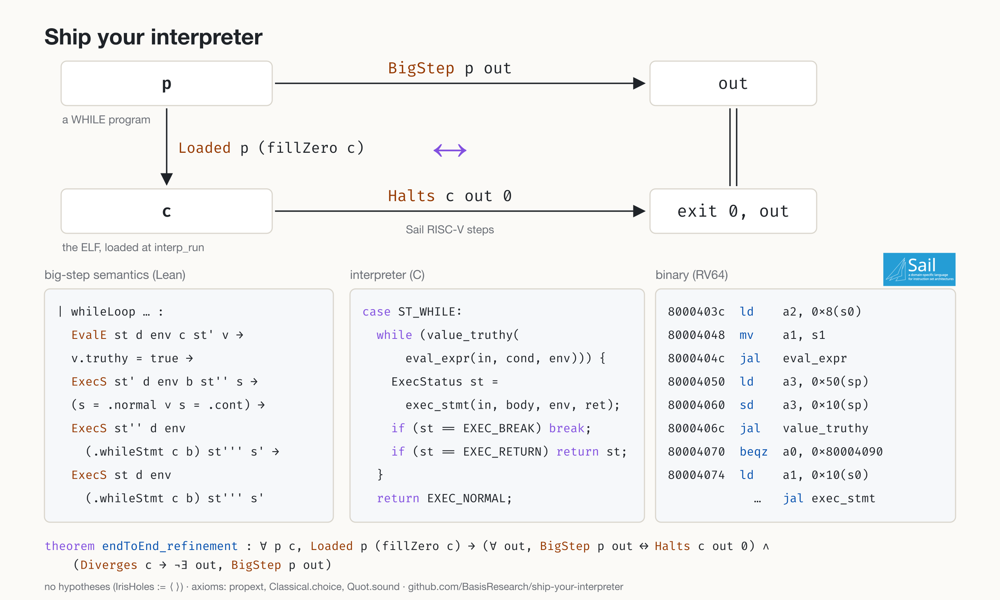

# Ship your interpreter

This Lean 4 project verifies `c/while-riscv-htif.elf`, a WHILE-language
interpreter compiled to bare-metal RV64 with HTIF I/O. The proof relates an
inductive big-step semantics of WHILE to the binary's execution in the
Sail-generated RISC-V model.



```lean
theorem endToEnd_refinement :
    ∀ p c, Loaded interpRunLayout p (fillZero c) →
      (∀ out, BigStep p out ↔ Halts c out 0) ∧
      (Diverges c → ¬ ∃ out, BigStep p out)
```

- Statement: [`VsaIris/Interp/EndToEnd.lean`](VsaIris/Interp/EndToEnd.lean). No hypotheses: every allocator and newlib routine the binary calls is proved.
- Axioms: `propext`, `Classical.choice`, `Quot.sound`.
- `Loaded` witnesses from real boot traces of ten programs: [`Vsa/Sim/Boot/`](Vsa/Sim/Boot). The proof ELF: `proofElf_halts` ([`Vsa/Sim/Boot/EndToEnd.lean`](Vsa/Sim/Boot/EndToEnd.lean)).
- Assumptions on the program: `capacity` (heap fits the arena), `stack_admissible` (recursion fits the stack).
- Soundness reviews of the hypotheses: [`REVIEW.md`](REVIEW.md), [`REVIEW2.md`](REVIEW2.md). Iris layer and its design: [`VsaIris/`](VsaIris), [`VsaIris/INTERP_DESIGN.md`](VsaIris/INTERP_DESIGN.md).

The behavioural trichotomy (`endToEnd_trichotomy`,
[`VsaIris/Interp/EndToEndTrichotomy.lean`](VsaIris/Interp/EndToEndTrichotomy.lean))
adds, under the same hypothesis: every nonzero exit is `70` (runtime error) or
`1` (out of memory), and the binary exits nonzero or diverges exactly when the
program errs or diverges in the semantics (`BigStepErr`/`BigStepDiverges`,
proved mutually exclusive in [`Vsa/While/Exclusive.lean`](Vsa/While/Exclusive.lean)).
The binary does not separate the two: its heap is finite and a divergent
program that allocates exits `1`.
The type system, the abstract interpreter and the program logic carry this to
the machine in
[`VsaIris/Interp/TrichotomyCorollaries.lean`](VsaIris/Interp/TrichotomyCorollaries.lean)
(`wellTyped_trichotomy`, `noAlarm_machine`, `noAlarm_terminating`,
`adequacy_exact`).

The tooling that makes this tractable is documented separately in
[`TOOLING.md`](TOOLING.md): proof generators, validation commands, and
incremental builds.

## Layout

| File | Content |
| --- | --- |
| `c/` | the C interpreter (lexer → parser → AST → evaluator), its host build, the cross-compiled RISC-V ELF under verification, and its test suite |
| `riscv-lean/` | vendored Sail-generated RISC-V models (`Lean_RV64D`, executable variant), a Lean emulator, and `lean-sail` at rems-project@0794631 patched so unmapped addresses read as zero (zero-initialised RAM) |
| `Vsa/ElfBytes.lean`, `Vsa/Elf.lean` | the ELF embedded byte-for-byte as a Lean term; ELFSage parse; a pure fuel-bounded runner over the Sail RV64D step. The native harness `vsa_run` reproduces the binary's behaviour: exit 0, `55\n2500\n36\n`, 382,730 steps |
| `Vsa/Machine.lean` | **the ISA as an inductive transition relation** (the graph of one architectural step), the behaviours `Halts`/`Diverges`, and determinism plus behaviour-uniqueness lemmas |
| `Vsa/While/Ast.lean` | deep embedding of WHILE, mirroring `c/src/ast.h` |
| `Vsa/While/Semantics.lean` | **the inductive big-step semantics**. Store-based mutable environments shared by closures, C truncating division, string coercion, `break`/`continue`/`return` statuses, `print`/`println`/`assert`. Purely relational: nothing in the theory evaluates WHILE |
| `Vsa/While/Derive.lean` | `bigstep_derive`, a syntax-directed tactic that *constructs* derivation trees of the big-step relation for closed programs. Untrusted meta-code; the kernel checks the derivations |
| `Vsa/While/Programs.lean`, `Vsa/While/Validation.lean` | the `c/tests/*.wl` scripts as deep embeddings, plus kernel-checked theorems `BigStep prog "<binary's output>"` that validate the semantics against I/O examples obtained by running the binary |
| `Vsa/MemRepr.lean` | **the inductive memory-representation relation**: when RV64 memory holds the C AST structs (`ast.h`, LP64, little-endian) that represent a deep-embedded program |
| `Vsa/While/Types.lean`, `Vsa/While/Type*.lean` | **a static type system for WHILE**, its preservation and progress theorems against `BigStep`, and worked examples |
| `Vsa/Refinement.lean` | **the ∀-program refinement theorem** |
| `VsaIris/WhileLogic/` | **the source-level program logic**: an Iris-style separation logic for WHILE over iris-lean's `UPred`, with total-correctness weakest preconditions sound against `BigStep`, adequacy down to the machine, and a verified loop (see below) |
| `Vsa/Triple.lean` | **the Layer 1 program logic**: total-correctness Hoare triples over the ISA relation, model-independent, with step-counting (`TripleN`) for divergence simulation |
| `Vsa/Compiler/` | verified WHILE → RV64 compilers: a subset compiler and the full compiler (see below) |
| `Vsa/AbsInt/` | **verified abstract interpretation** of WHILE: a domain interface, a generic abstract interpreter, constant/sign/interval/kind domains and their products, soundness for `BigStep` and for runtime-error verdicts; the machine corollary is in `VsaIris/AbsInt/Machine.lean` |
| `Vsa/Sim/` | Instruction decoding, runtime representations, function contracts, recursive simulation, and residual suppliers |
| `experiments/` | Lean proof probes, SMT and fuzz validation, and coverage data |
| `experiments/smt/PROOF_CLOSURE_PLAN.md` | Current proof status, remaining work, and incremental-build rules |

## The refinement statement

```lean
theorem refinement {L : Layout} (H : InterpSim L) :
    ∀ p c, Loaded L p c →
      (∀ out, BigStep p out ↔ Machine.Halts c out 0) ∧
      (Machine.Diverges c → ¬ ∃ out, BigStep p out)
```

`Loaded L p c` says configuration `c` sits at the interpreter phase with `p`'s
memory representation, via the inductive `ProgramRepr`. `InterpSim` is the
forward-simulation obligation. Every derivable behaviour is realised by the
machine, and underivable programs never halt cleanly.

The theorem is instantiated at `L := Vsa.Sim.LayoutInstance.interpRunLayout`
(`Vsa/Sim/LayoutInstance.lean`), whose `Loaded` is
`∃ a n, ProgramRepr c.σ.mem a n p ∧ InterpRunReady c a n`. It is the
theorem's whole hypothesis, so read it as the contract with the loaded
binary. `InterpRunReadyFacts` requires, at `interp_run`'s entry:

- **Machine state.** `pc = 0x800043ec`; the ABI arguments `a0 = &interp`
  (`0x87fffe10`), `a1 = stmts`, `a2 = count`, `a3 = 0` (script mode);
  `ra`, `sp = 0x87fffd00`, `gp`, `s0 = &_impure_ptr`; every general register
  present; `GoodState` (machine mode, `misa`/`mstatus` at their reset
  values, traps undelegated, HTIF idle); `main`'s saved return address.
- **Image and runtime data.** The exact `.text` and `.rodata` bytes of
  `c/while-riscv-htif.elf` (`FixedTextLoaded`, `FixedRodataLoaded`), the
  static pins `snprintf`/`vfprintf` read, newlib's stdout `FILE`
  (`ConsoleStream`: unbuffered, one-byte buffer, `__swrite`), the idle
  `stdin`/`stderr` `FILE`s and empty `atexit` list (`ExitRuntimeData`),
  `_impure_data._stderr`, and no console output yet (`OutRepr`).
- **The interpreter object.** `Interp.globals` and `call_depth = 0`, the
  object and its `jmp_buf` inside RAM above the HTIF words, and 8 MiB of
  stack below `sp` with every stack byte present in the memory map.
- **The AST.** `stmts` is an 8-aligned array of `count` `Stmt*` in RAM,
  `ProgramRepr` holds for `p`, and the AST's bytes are immutable shared
  bytes: outside the writable ELF sections, the stack, the global frame's
  header and arrays, and every allocation the interpreter may write
  (`InitialOwned`). Strings are ASCII (`CStr` requires bytes below 128).
- **The initial store.** The global frame holds exactly `print`, `println`,
  `assert` (`StoreRepr initSt.store` with their entry addresses), with
  capacity 8, in three whole in-use dlmalloc chunks (`BootFrameChunks`).
- **The allocator.** dlmalloc's heap `[_end, __heap_end)` in its canonical
  shape (`DlHeap.HeapAt`: a chunk walk from `_end` to the top chunk, free
  chunks on exactly one well-formed bin, page-aligned break, 32-bit
  `binblocks`, the top chunk at least 16 bytes below the break).
- **Two program-dependent assumptions**, both universally quantified over
  the program the memory represents:
  - `InitialAllocatorAt.capacity` — for every terminating derivation of
    `p` with modeled allocation cost `n` (`Vsa/While/Cost.lean`),
    `2 * n + 8256 ≤ __heap_end − top`: the heap has room for the run. A
    terminating program that allocates more than the free heap is *not*
    `Loaded`; the binary prints `out of memory` and exits 1, and the
    theorem says nothing about it.
  - `stack_admissible` — `ProgramStackFits p`: the statically computed
    stack need of `p` (nesting depth of its statements and expressions,
    the 1000-deep call budget, the evaluator frame, the helpers'
    headroom, `interp_run`'s frame) fits below `sp`, and every function
    body fits one call level.

`REVIEW.md` audits this hypothesis against the binary's real entry state;
the fields that no real run satisfies are listed there with proposals, all
landed (P1–P4, P7). `REVIEW2.md` is the final audit: the theorem is
unconditional (the former `IrisHoles` was emptied and removed), and it is instantiated at the
binary's real `interp_run` entry states.

**The witnesses and the two native links.** `Loaded` is proved by the kernel
at ten real entry states (`Vsa/Sim/Boot/Gen/<Prog>.lean`, generated by
`scripts/gen_boot_witness.py`): the memory is the ELF loader's image plus the
emulator's traced store log, the registers are the traced `x1 … x31`, and
`Gen.<Prog>.loadedEntry_fill` states the witness at ANY configuration whose
registers satisfy `EntryRegs` (`GoodState`, `PC`, `htif_payload_writes`, the
traced GPRs; `Vsa/Sim/Boot/Entry.lean`), whose console is empty and whose
memory the entry view is a partial view of. `Vsa/Sim/Boot/Audit.lean` derives
the hypothesis-free capstones from them (`ReviewV2.proofElf_halts_entry`:
that state prints `55 2500 36` and exits 0; `errDivzero_never_clean_entry`).
Two facts connect the generated data to the binary and are checked
**natively, not by the kernel** (the kernel never parses the 138 KB ELF and
never runs the boot): (1) `ElfLoads` — the ELFSage parse of `Vsa.elfHex`
loads exactly the generated image (`initializeMemory_eq` takes it as a
premise); (2) the traced store log is the machine's — the emulator's
`--trace-all` store operands, whose fold the kernel checks (`LogOk`).
`experiments/review-v2/Replay.lean` re-checks both per build
(`scripts/check_all.sh` stage c3): it evaluates `ElfLoads`, runs the theorem's
own `Vsa.stepOnce` from `initializeMemory` to the entry, and compares the
reached state with the witness (every byte, `EntryRegs`, the console), then
runs both to halt. These two links, and the emulator itself, are the trust
base beside the Lean kernel and the Sail model.

```lean
theorem Vsa.Sim.EndToEnd.endToEnd_refinement :
    ∀ p c, Loaded interpRunLayout p (fillZero c) →
      (∀ out, BigStep p out ↔ Halts c out 0) ∧ (Diverges c → ¬ ∃ out, BigStep p out)
```

The final theorem `Vsa.Sim.EndToEnd.endToEnd_refinement`
(`VsaIris/Interp/EndToEnd.lean`) is `refinement` at the concrete layout, stated
at the fill-with-zero of the configuration: `Loaded interpRunLayout p
(Vsa.Densify.fillZero c)`, where `fillZero c` inserts every absent RAM byte as
`some 0`. The Sail model reads an absent byte as `0` and never inspects
presence (`Vsa/Densify/`: `stepOnce_resp`, hence `halts_fillZero`,
`diverges_fillZero`), so the conclusion is about the real configuration `c`
while `Loaded`'s presence fields (the 8 MiB stack, adequacy's live set) are
checked on the dense view, which is what the loader's sparse memory never
satisfies literally (`REVIEW.md` C3). `endToEnd_refinement_loaded` is the same
theorem at a literally `Loaded` configuration.

```lean
structure InterpSim (L : Layout) : Prop where
  term_sim  : ∀ p c out, Loaded L p c → BigStep p out → Halts c out 0
  stuck_sim : ∀ p c, Loaded L p c → (¬ ∃ out, BigStep p out) →
              Diverges c ∨ ∃ out e, Halts c out e ∧ e ≠ 0
```

Given forward simulation, `Refinement.lean` *derives* the backward direction
(whatever the machine does was specified) and divergence preservation from
machine determinism by classical case analysis. This is the composition
CompCert uses to get behavioural equivalence out of a forward simulation over
a deterministic target. `InterpSim` stays an explicit hypothesis.

The simulation lemmas in `Vsa/Sim/` relate compiled
`eval_expr`/`exec_stmt`/`interp_run` code to the big-step rules by induction on
derivations.

## A verified compiler for a WHILE subset

`Vsa/Compiler/` compiles programs in a subset of WHILE directly to RV64
instructions (`compile`, `Compile.lean`). `Supported` (`Subset.lean`) admits
integer and boolean expressions over statically resolved variables
(`+ - * / %`, comparisons, `!`, unary `-`, assignment), `if`/`while`/blocks,
`break`/`continue` inside loops, declarations with an initializer, and
`print`/`println` of up to 32 integers. Each declaration site has a static slot.
Where the semantics has no derivation (for example, division by zero), the
code exits with code 70.

```lean
theorem compile_correct (p : Program) (hsup : Supported p)
    (hfit : 0x80004800 + 4 * (compile p).length ≤ 0x8001ad00) (c : Config)
    (hgood : GoodState c.σ) (htick : c.tick < 2)
    (hpc : c.σ.regs.get? Register.PC = some 0x80004800#64)
    (hpw : c.σ.regs.get? Register.htif_payload_writes = some 0#4)
    (hout : output c.σ = "")
    (hcode : ∀ k, k < (compileBytes p).length →
      c.σ.mem[0x80004800 + k]? = (compileBytes p)[k]?)
    (hlib : Code.__muldi3Loaded c.σ.mem ∧ Code.__divdi3Loaded c.σ.mem ∧
      Code.__umoddi3Loaded c.σ.mem ∧ Code.__hidden___udivdi3Loaded c.σ.mem ∧
      Code.__moddi3Loaded c.σ.mem) :
    (∀ out, BigStep p out ↔ Halts c out 0) ∧ (Diverges c → ¬ ∃ out, BigStep p out)
```

The proof relates machine configurations to an abstract machine (`Machine.lean`,
`Lift.lean`: one abstract step is at least one Sail step, and libgcc calls are
single abstract steps through `muldi3_spec`/`divdi3_wrap_spec`/`moddi3_spec`),
proves forward simulation by induction on derivations (`StmtT.lean`), and shows
that a program without a derivation reaches the error exit or runs forever
(`StmtS.lean`). `whileWl_compiled_halts` (`WhileWl.lean`) instantiates the
theorem at `c/tests/while.wl`: the compiled code prints `55\n2500\n36\n` and
exits `0`. `experiments/compiler/RunCompiled.lean` runs compiled programs on the
executable Sail model.

## The full WHILE compiler

`compileG` (`CodeGen.lean`) compiles the whole language: integers, booleans,
`null`, strings, closures with captured environments, calls to user functions
and to `print`/`println`/`assert`, `return`, `for`, `while`, `if`, blocks,
`break`/`continue`, and assignment. Values are tag/payload pairs; strings and
closures live in a bump-allocated object heap, frames in a bump-allocated frame
region with one static layout per scope, and calls use a machine stack bounded
by `maxCallDepth`. The code links a runtime (`RTCode.lean`: truthiness,
printing, integer formatting, string concatenation and comparison, equality,
frame allocation) and libgcc's multiply/divide routines.

`SupportedG p` (`CorrectG.lean`) requires the program to be well formed against
its string table and global frame (`WfSeq`, `Wf.lean`) and its static image to
be small (`SetupOK`). Heap exhaustion is excluded with the existing cost
semantics: every behaviour must have a `BigStepBudget` of `heapUnits`
(`0x3F8000`) units, at most 64 heap bytes each.

```lean
theorem compileG_correct (p : Program) (hsup : SupportedG p)
    (hfit : 0x80004800 + 4 * (compileG p).length ≤ 0x8001ad00)
    (hcap : ∀ out, BigStep p out → BigStepBudget p out heapUnits) (c : Config)
    (hgood : GoodState c.σ) (htick : c.tick < 2)
    (hpc : c.σ.regs.get? Register.PC = some 0x80004800#64)
    (hpw : c.σ.regs.get? Register.htif_payload_writes = some 0#4)
    (hout : output c.σ = "")
    (hcode : ∀ k, k < (compileGBytes p).length →
      c.σ.mem[0x80004800 + k]? = (compileGBytes p)[k]?)
    (hlib : Code.__muldi3Loaded c.σ.mem ∧ Code.__divdi3Loaded c.σ.mem ∧
      Code.__umoddi3Loaded c.σ.mem ∧ Code.__hidden___udivdi3Loaded c.σ.mem ∧
      Code.__moddi3Loaded c.σ.mem) :
    (∀ out, BigStep p out ↔ Halts c out 0) ∧ (Diverges c → ¬ ∃ out, BigStep p out)
```

Proof structure:

- `WP.lean`, `RTBase.lean`: a weakest-precondition calculus over the abstract
  machine and the `wp_simp` normal form; each runtime routine is proved once
  against the semantics (`RTLeaf`, `RTItos`, `RTDisplay`, `RTOps`).
- `SimInv.lean`: the invariant `MS` relating a semantic state to a machine
  state (store relation `StoreRel`, object image, closure code, register and
  stack discipline).
- `SimAll.lean`: `sim_all` simulates every derivation of the nine cost
  relations (`Vsa/While/Cost.lean`), by their recursor, with one lemma per rule
  (`Sim*.lean`); a derivation of cost `n` either completes or stops at the error
  exit because the heap has no room for `n` units.
- `StuckAll.lean`: `stuck_all` shows that a phrase without an execution reaches
  the error exit or runs for at least `n` steps, for every `n` (strong induction
  on `n`; loop iterations and closure calls take at least one step).
- `SetupRun.lean`: the setup code writes the string table, allocates the
  global frame and binds the natives, establishing `MS` for `initSt`.

`CompiledG.lean` instantiates the theorem at `functionsWl`, `forWl`, `scopeWl`
and `stringsWl` (`*_compiledG_halts`). `experiments/compiler/RunCompiledG.lean`
runs compiled programs on the executable Sail model.

### The checked compiler

`compileChecked` (`Vsa/Compiler/Checked.lean`) returns `compileG p` only when
`supportedGB p`, `fitsB p` and the allocation-cost analysis (`progCost` over
`Const × Itv`, below) bounds every run of `p` by at most `heapUnits`. Its
correctness theorem has no program premise besides acceptance:

```lean
theorem compileChecked_correct (p : Program) (code : List Ins)
    (hc : compileChecked p = some code) (c : Config) …
    (hcode : ∀ k, k < (codeBytes code).length →
      c.σ.mem[0x80004800 + k]? = (codeBytes code)[k]?) … :
    (∀ out, BigStep p out ↔ Halts c out 0) ∧ (Diverges c → ¬ ∃ out, BigStep p out)
```

(the elided hypotheses are those of `compileG_correct` other than `hsup`,
`hfit` and `hcap`). `whileWl_checked` accepts `while.wl` (bound 8272 units; its
exact cost is 6992), and `whileWl_checked_halts` is the unconditional halting
theorem for its compiled code. The analysis leaves calls into closures and
string concatenation unbounded, so programs using them are rejected.

### `whilec`: the compiler as an executable

```sh
lake build whilec
.lake/build/bin/whilec prog.wl -o prog.elf        # compile
.lake/build/bin/whilec prog.wl --run              # compile, then run on the Sail RV64 model
spike prog.elf                                    # run bare-metal (HTIF console)
```

`whilec` parses the source with the interpreter's grammar
(`Vsa/Compiler/Parse.lean`, a line-for-line port of `c/src/parser.c`; it
reproduces the ASTs of `Vsa/While/Programs.lean` for every file in
`c/tests/`). It checks the premises of the theorem with `supportedGB` and
`fitsB`, which are proved sound, so `checked_correct` applies to every program
it accepts. It compiles the program with `compileG` and writes an ELF
(`Vsa/Compiler/Image.lean`): the interpreter image `c/while-riscv-htif.elf`,
which provides libgcc, `tohost` and `fromhost`, with the compiled code at
`0x80004800` and the entry point set there. Programs print through the HTIF
console. They exit with `0` on success and `70` on a runtime error
(including heap exhaustion). `whilec` rejects unsupported programs and reports
parse errors. The front end and the ELF writer are not verified.

## Abstract interpretation

`Vsa/AbsInt/` is a static analyser for WHILE, proved sound against `BigStep`
and carried to the machine by `endToEnd_refinement`.

- `AbsDom A` (`Domain.lean`): order, join, widening, `⊤`, concretisation
  `Gam : A → Value → Prop`, and transfer functions, each with its soundness law.
- `aexec` (`Interp.lean`): the abstract interpreter over the AST, generic in
  `A`. Its states are scope chains (`State.lean`). Loops are unrolled up to
  `Cfg.unroll` iterations, then covered by a checked post-fixpoint found by
  widening and narrowing. Calls into closures are not analysed (the state
  becomes `⊤`); natives the domain identifies are.
- Domains (`Domains/`): `Const`, `Sign`, `Itv` (64-bit-wrap aware), `KSet`
  (value kinds), and `A × B` with a `Reduce` hook; `Const × Itv` is reduced.
- Soundness: `analyze_sound` (every completion of a run is in `γ` of the
  analysis), `bigStep_global` (final values of globals), `kind_sound`
  (an unreported error kind occurs in no run), `no_error_of_no_alarms`.
  Runtime errors of kind `k` are `ExecSeqErrK`, generated from `ErrorSem` by
  `scripts/gen_errk.py`.
- Allocation cost (`CostAnalysis.lean`, `CostSound.lean`): `progCost cfg p`
  bounds the allocation cost `Vsa/While/Cost.lean` assigns to any successful
  run (`progCost_sound : progCost cfg p = some n → ∀ out, BigStep p out →
  BigStepBudget p out n`). Frames, closures and bindings are charged from the
  abstract states; binding counts are bounded by the abstract scope's names
  (`NoDup.lean`). Loops are summed over the unrolled iterations; past them,
  a zero-cost iteration costs nothing, and a counted condition `x < e` /
  `x <= e` bounds the iterations when the offset domain (`Domains/Offset.lean`)
  shows each iteration raises `x`. Calls into closures and string
  concatenation are unbounded (`none`).
  `loaded_of_checked` (`Vsa/Sim/CheckedBoundary.lean`) replaces the
  heap-capacity and stack-admissibility premises of `Loaded` by this bound, the
  `programStackFits` checker and a numeric free-heap fact (`HeapRoom`);
  `endToEnd_checked` (`VsaIris/Interp/EndToEndChecked.lean`) is the resulting
  end-to-end theorem.
- Examples (`Examples.lean`, by `decide +kernel`): on `whileWl` the kind
  domain proves no type errors; `Const × Itv` proves no runtime error at all and
  that every run ends with `sum = 55`, `total = 2500`, `acc = 36`.
  `whileWl_machine` (`VsaIris/AbsInt/Machine.lean`) states this for the
  loaded binary: a clean halt comes from such a run.
## The WHILE program logic

`VsaIris/WhileLogic/` is a separation logic for WHILE programs, built on the
big-step semantics and iris-lean's BI (`vProp := UPred Res`).

- **Resources** (`Res.lean`). Partial stores: an exclusive cell per scope,
  `a ↦f F` (parent pointer and bindings), an exclusive cell per closure,
  `c ↦c cd`, and the console, `outIs o`.
- **Weakest preconditions** (`WPGen.lean`, `WP.lean`). `wpR lo R Φ` is the
  total-correctness WP of a big-step relation `R`. It quantifies over the frame
  resource, so every WP satisfies the frame rule (`wpR_frame`, `Triple.frame`).
  `wpE`/`wpArgs`/`wpCall`/`wpS`/`wpSeq` instantiate it at
  `EvalE`/`EvalArgs`/`Call`/`ExecS`/`ExecSeq`.
- **Rules**. Variable lookup and assignment in the current or the parent scope,
  `var`, blocks (fresh scope), `if`, `while` (`wp_while`: invariant `I k`
  with a decreasing variant `k`), `for` (`wp_for` allocates the loop scope and
  runs the initializer; `wp_for_loop` is the invariant/variant rule for the
  condition, body and step), `break`/`continue`/`return`, sequencing,
  function literals and closure calls (fresh parameter scope at depth `d + 1`),
  `print`/`println` (append to the console), and `assert`.
- **Adequacy** (`Adequacy.lean`, `Machine.lean`). From
  `initOwn ⊢ wpSeq 0 0 p (PostOut Q)`, `adequacy_bigStep` gives
  `∃ out, BigStep p out ∧ Q out`. `adequacy_machine` composes this with
  `endToEnd_refinement`: every configuration with `p` loaded halts with exit
  code 0, prints an output satisfying `Q`, and does not diverge.
- **Examples**. The first loop of `tests/while.wl` prints `55`
  (`Example.firstLoop_spec`, a loop invariant with variant `10 - n`). The
  whole script prints `55\n2500\n36\n` (`Whole.whileWl_spec`: `break`,
  `continue`, and a nested loop whose body reaches the globals through two
  scopes). `firstLoop_halts` and `whileWl_halts` (`Machine.lean`) are the
  machine consequences. `ClosureExample.lean` calls a function literal;
  `ForExample.lean` sums `1..100` with a `for` loop (`5050`).
## Type safety

`Vsa/While/Types.lean` types WHILE with simple types, function types and
singleton builtin types under one program-wide typing environment
`Δ : String → Ty`; typing tracks the names bound along the scope chain, the
return type and the loop context. `WellTyped Δ p` is the program judgment.

* `preservation` (`Vsa/While/TypePreservation.lean`): each of the nine
  big-step relations preserves store typing, and values and completion statuses
  have their static types.
* `progress` and `type_soundness` (`Vsa/While/TypeProgress.lean`): every
  runtime error of a well-typed program is division or remainder by zero, a
  failed `assert`, or the call-depth cap (`ExecSeqErrN`), so a well-typed
  program terminates normally, reaches one of those errors, or diverges.
* `wellTyped_machine` (`VsaIris/Interp/TypeSafety.lean`): with
  `endToEnd_refinement`, a loaded well-typed program's machine run that halts
  with a nonzero exit code reaches one of those errors or diverges at the
  source level.
* `typeCheck_iff` (`Vsa/While/TypeCheck.lean`): the checker `typeCheck Δ p`
  decides `WellTyped Δ p`, so `decide` proves typings.
* `infer_sound`, `infer_complete`, `whileTyped_iff`
  (`Vsa/While/TypeInfer.lean`): `infer p` finds a typing environment exactly
  when one exists, so the WHILE type checker `whileTyped p` decides
  `Typable p := ∃ Δ, WellTyped Δ p`. It rests on verified first-order
  unification (`Vsa/While/Unify.lean`) and a complete search
  (`Vsa/While/TypeSearch.lean`) whose result `typeCheck` confirms.
  `whileTyped_machine` (`VsaIris/Interp/TypeSafety.lean`) states machine-level
  type safety for accepted programs.
* `Vsa/While/TypeExamples.lean`: `whileWl` and the other validation programs
  type-check; `badSub`, `badAssign` and `recursionWl` are untypable.

`whilecheck` runs `whileTyped` on `.wl` files outside Lean. It parses them
with the grammar of `c/src/parser.c` (`Vsa/While/Parse.lean`, not verified)
and prints the inferred type of every declared name, or the first problem
found:

```sh
lake build whilecheck
.lake/build/bin/whilecheck c/tests/functions.wl
.lake/build/bin/whilecheck --selftest c/tests   # parser vs. Programs.lean
scripts/test_whilecheck.sh
```

## Building

```sh
python3 scripts/build_private.py \
  --output-root /private/tmp/vsa-full-build.sQd0gM \
  --include-executable --resume
```

Reuse the private build cache above. On a new checkout, create one external
directory with `mktemp -d` and retain it for subsequent runs. Dependencies in
`riscv-lean/` must already be built. This command typechecks all project Lean
sources, including `VsaRun.lean`.

Use the Lean version in `lean-toolchain`. Follow [CLAUDE.md](CLAUDE.md) for
proof discipline and [TOOLING.md](TOOLING.md) for focused verification.
Preserve the proof ELF; build interpreter variants in a temporary copy of `c/`.
